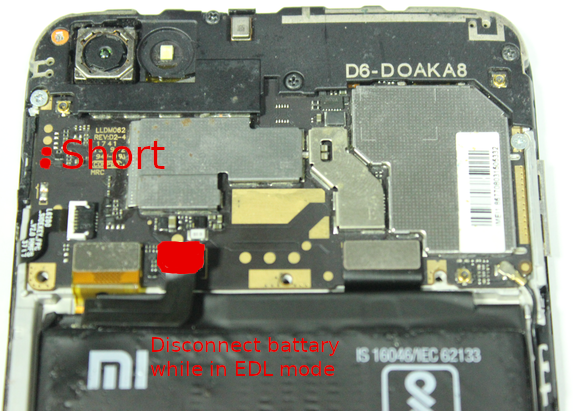
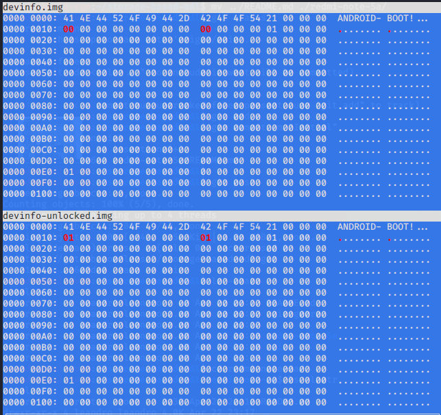

# Redmi Note 5A (Bypass user lock)
## Storage based Attack - using EDL Programmers

This is just a guide to anybody who has the wright (by being the owner of the data for example) to access files stored in a Redmi Note 5A (MDG6). To accomplish this task, we will be using the vulnerability described here [Storage based Attack - using EDL Programmers](https://alephsecurity.com/2018/01/22/qualcomm-edl-2/). The first tool we need was made by [Reverse Engineer Bjoern Kerler](https://github.com/bkerler/edl). The seccond tool is the specially crafted boot image made by AlepthSecurity Team, which can be found [here](https://github.com/alephsecurity/firehorse). **Basically, bootloader will be unlocked, then it will be possible to boot the specially crafted boot image with fastboot (without flashing). At the end, you might want to relock your bootloader**


## Risks
This procedure was tested on Redmi Note 5A, model MDG6, with Android 7.1.2 N2G47H, security patch 2019-08-01, with MIUI Global 11.0.3. A very small portiona will be written (devinfo partition) and for what I know/tested it's easy to recover if anything goes wrong. Besides that, it's needless to say that you are doing it at your own risk.

## Setup 
#### Debian based system
```bash
sudo apt install adb fastboot python3-dev python3-pip liblzma-dev git
sudo apt purge ModemManager

git clone https://github.com/bkerler/edl.git
cd edl
git submodule update --init --recursive
sudo cp Drivers/51-edl.rules /etc/udev/rules.d
sudo cp Drivers/50-android.rules /etc/udev/rules.d
sudo python3 -m pip install -r requirements.txt
```

## Creating EDL (Emergency Download Mode)
1. Take off the back cover
2. Disconnect the battery cable (make sure it's fully charged)
4. Connect USB Cable to the device (do not connect to the Linux Based Station yet)
5. Enter edl project you've just cloned from [bkerler](https://github.com/bkerler/edl.git) (cd edl). Type ./edl.py (make sure you have python working correctly). You should see some dots being printed in your terminal, do not connect the phone yet.
7. Test Points showned in the following image must be shortened with a tweezers for a second or two, at the same time you plug USB cable to the PC. 



## Unlocking your device
1. Dump devinfo partition
```bash
./edl.py r devinfo devinfo.img
```
3. Make a copy and patch the file with an Hex Editor
```bash
cp devinfo.img devinfo-unlocked.img
wxHexEditor devinfo-unlocked.img 
```
5. Change bytes 0x10 and 0x18 from 0x00 to 0x01 (see picuture)



## Security bypass
1. You should be able to see a small message while leaving EDL mode meaning that your device just had been unlocked.
2. Turn it off and enter FASTBOOT MODE by pressing power + volume down.
3. While in fastboot mode do the following
```bash
fastboot boot boot-ugglite-root.img
#wait for the device to turn on
adb devices... #should be able to have root access
```
